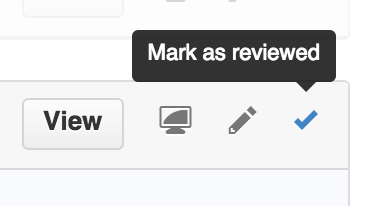

# No Longer Supported

Github finally released this feature. So now this chrome extension is of no use anymore.

------

# Github PR Reviewer

Chrome extension that just runs a simple script while on github to add a checkbox to PR files. When you click the checkbox it collapses it so you can keep track of which files you have already reviewed.

## Installation

1. Download
2. Go to chrome://extensions/
3. Click "Load Unpacked Extension" (You might need to check "Developer mode" first)
4. Select folder
5. Get reviewing
